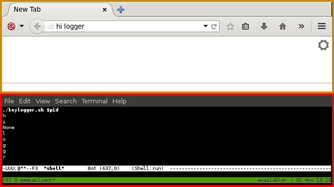

# xorg keylogger

A process specific userland keylogger, written in bash/python, that uses
strace to log recvfrom system calls that retrieve XKeyEvents.  The code base
is simple and small making it easy to see how this works.  The price to be
paid for such a simple code base is performance.  Type too fast and some keys
will probably be missed.

# examples

An example of the keylogger working on a firefox process:

# installation requirements

-   strace version 4.5.20

-   grep (GNU grep) 2.10

-   GNU sed version 4.2.1

-   Python 2.7.3 (will probably work with Python3 if you just change the print
    statement to a function)

# status

-   Keylogger is rendered obsolete by disallowing ptrace attachments that aren't
    directly from parent to child process or by non-root users.

-   Keylogger only logs lower case letters.
